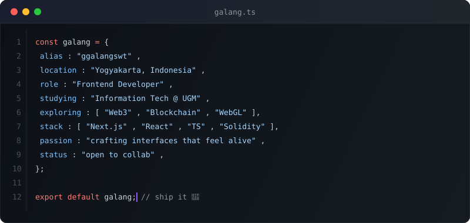

  

 

 

  

 

## ╭─ tech stack ─╮

 

 

 

## ╭─ github activity ─╮

  

 

## ╭─ contribution snake ─╮

<picture>
  <source media="(prefers-color-scheme: dark)" srcset="https://raw.githubusercontent.com/ggalangswt/ggalangswt/output/github-snake-dark.svg" />
  <source media="(prefers-color-scheme: light)" srcset="https://raw.githubusercontent.com/ggalangswt/ggalangswt/output/github-snake.svg" />
  
</picture>

 

  
    
  

